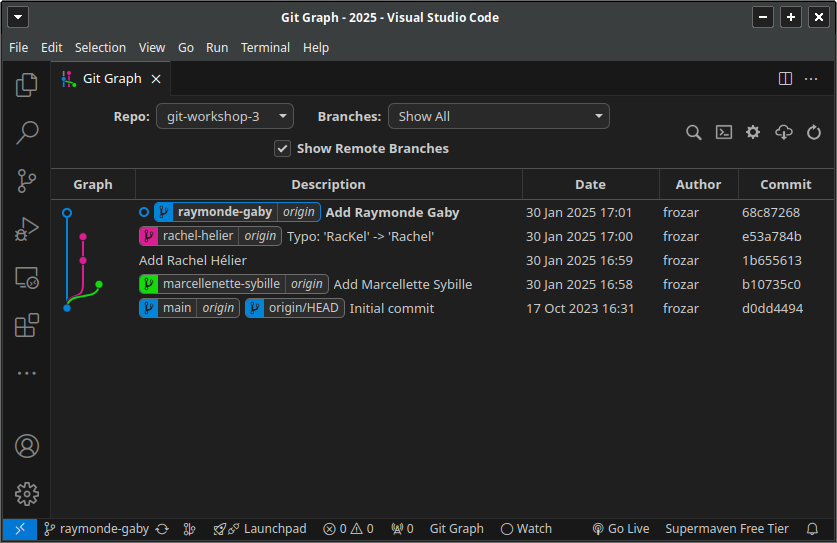
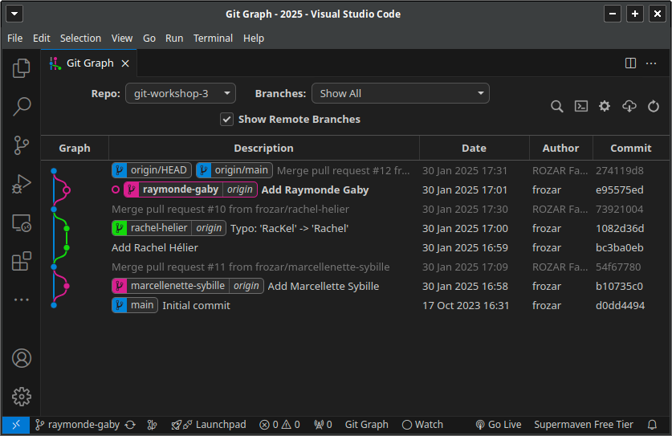
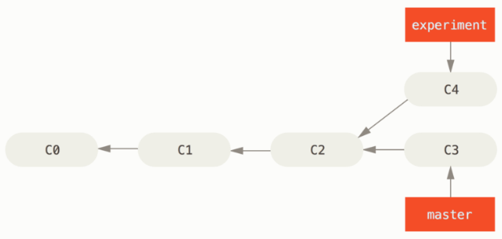
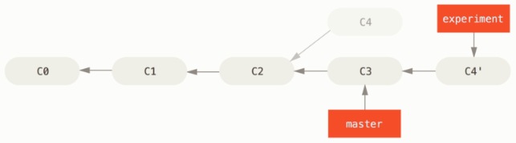
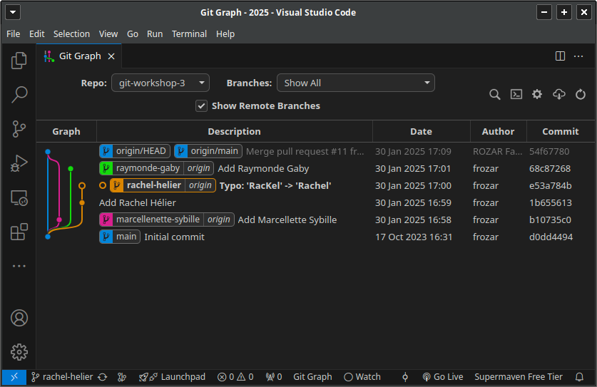
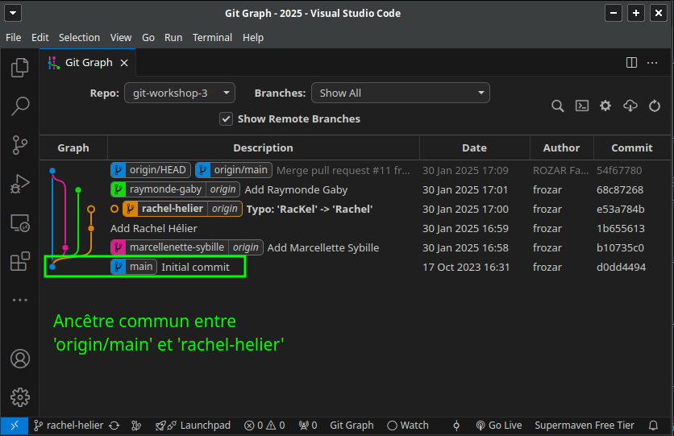
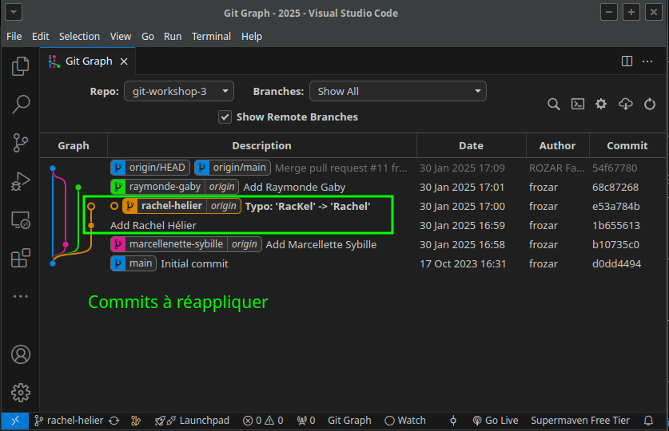
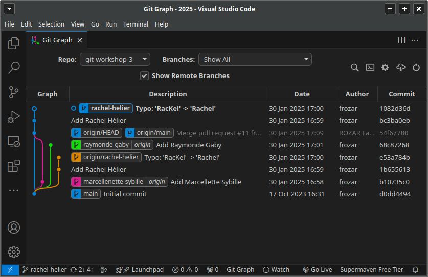
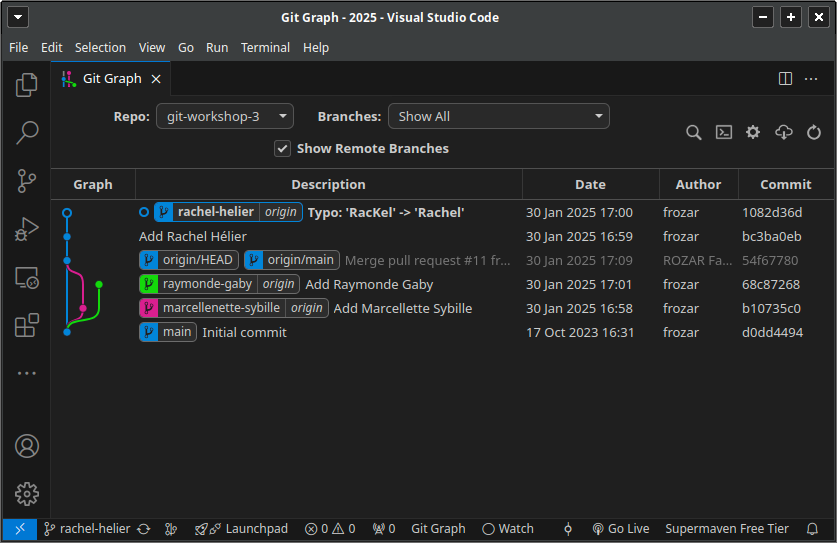

# Consigne

**Objectif** : utiliser des rebases pour linéariser l'historique de commits.

Instructions
 - 1 personne du groupe fork ce dépôt principal
 - la personne qui crée le fork doit ajouter ces collègues comme collaborateur du dépôt
 - les collaborateurs récupèrent le dépôt forké
 - chaque collaborateur crée une branche au format `prenom-nom` à partir du commit initial
 - à partir de sa branche `prenom-nom`, chaque collaborateur va ajouter son prénom/nom à la liste des auteurs dans le fichier `authors.txt` dans un commit
 - chaque collaborateur propage sa branche `prenom-nom` sur le dépôt distant
 - chaque collaborateur crée une Pull Request sur Github pour merger sa branche `prenom-nom` avec la branche main distante. Attention : le dépôt de destination du merge est votre dépôt (le fork), pas le dépôt d'origine (créé par l'utilisateur Github `frozar`)
 - chaque collaborateur fait une revue de code dans la Pull Request
 - s'il n'y a pas de modification à faire suite à la revue de code, l'auteur de la Pull Request accepte cette-dernière
 - suite au merge de la première Pull Request, cela va potentiellement générer des conflits sur les autres Pull Request. Pour résoudre ce conflit, l'auteur de la Pull Request doit:
   - mettre à jour sa branche main locale
   - effectuer un rebase de sa branche `prenom-nom` locale au dessus de sa branche main locale 
   - propager sa branche `prenom-nom` sur le dépôt distant
   - une fois ces étapes réalisées, Github verra que la Pull Request associée à la branche `prenom-nom` ne présente plus de conflit et permettra de l'accepter
 - à la fin de l'activité, le dépôt du groupe doit avoir :
   - un historique avec des ponts qui représentent les différents merges
   - une la branche principale et les branches de développement

Pour se faire, vous aurez besoin de l'ensemble des savoirs des workshops précédents, plus les commandes git suivantes :
 - **push -f** : forcer la propagation de la branche sur un dépôt distant malgré une divergence 

Lisez les sections de la "Boite à outils" pour réaliser cet exercice.

## Dans l'historique de commits

Une fois que les différentes branches `prenom-nom` sont créées et propagées sur le 
dépôt distant, vous devriez voir un historique similaire à celui-ci :

Une fois que toutes les Pull Requests sont acceptées, vous devriez voir un histoirique
similaire à celui-ci, avec les différents ponts représentants les différents merges :

Visualisez les changements de l'historique des commits après chaque commande git.

## Bilan

Vous savez maintenant faire des rebases pour linéariser l'historique de commits.

**Remarque 1** : grâce à l'utilisation des rebases, l'historique de commits est 
de nouveau simple à interpréter.

**Remarque 2** : la commande rebase réapplique des commits au dessus d'un commit donné.
Dans le cas où vous avez un certain nombre de commits à appliquer (longue branche),
et que vous avez des conflits dès les premiers commits, il peut arriver que
vous deviez résoudre de façon répétitive les conflits. En fonction du projet
et de la politique de développement, l'utilisation du rebase peut s'avérer fastidieuse.

# Boite à outils

## git rebase

### Exemple issu de la documentation officielle

La commande `git rebase` s'utilise dans le cas où vous avez un historique de commits
divergeant :

Dans cette exemple, on voit que les branches `experiment` et `master` ont le 
commit `C2` en commun, aussi appelé `ancêtre commun`. Cependant, sur les branches 
`experiment` et `master` nous avons respectivement les commits `C4` et `C3` qui
sont différents.

Dans cette situation, si vous souhaitez mettre à jour la branche `experiment` par 
rapport à la branche `master`, vous pouvez utiliser la commande `git rebase` :
 - placez vous sur la branche `experiment`: `git switch experiment`
 - rebasez la branche `experiment` sur la branche `master`: `git rebase master`

Le résultat de cette commande est que le commit `C4` a été réappliqué au dessus de 
`master`. Vous remarquerez l'apostrophe ajouté au label de ce commit, `C4'`. 
Le contenu de ce commit est le même que celui de `C4`, mais il n'aura pas le 
même `SHA1` car son commit parent a changé.

Suite à ce résultat, vous pouvez vous demander : comment est-ce que git a 
déduit l'ensemble des commits qui sont à réappliquer au dessus de `master` ?

Pour répondre à cette question, il faut comprendre qu'au moment où vous tapez
une commande `git rebase`, il y a dans un 1er temps 2 éléments à considérer :
 - la branche sur laquelle vous êtes : `experiment`
 - la branche sur laquelle vous souhaitez réappliquer les commits : `master`

A partir de ces éléments, git peut calculer l'ancêtre commun entre ces 2 branches.
Sur cette illustration, cela correspond au commit `C2`.

Dans un deuxième temps, git est programmé pour identifier les commits qui
sont compris entre `C2` et `experiment`, (`C2` exclus), et c'est cet ensemble 
de commit qui sera réappliqué au dessus de `master`. Donc dans cet exemple, 
uniquement le commit `C4`.

[source : Documentation officielle](https://git-scm.com/book/fr/v2/Les-branches-avec-Git-Rebaser-Rebasing)

### Exemple issu de ce workshop

Dans le cadre de cet exercice, vous aurez besoin d'utiliser la commande `git rebase`
pour résoudre un conflit détecté par une Pull Request.

Votre historique de commits devrait ressembler à celui-ci :

 

Après avoir mise à jour vos références locales de branches distantes avec un 
`git fetch`, vous devriez avoir un historique de commits similaire à celui-ci :

 

Dans cet exemple, je suis sur la branche `rachel-helie` et je veux réappliquer
les commits de cette branche au dessus de la référence `origin/main`.  

Mais quels sont les commits qui seront réappliqués au dessus de `origin/main` ?

Pour répondre à cette question, vous devez identifier l'ancêtre commun entre
la branche `rachel-helie` et `origin/main`. Dans cet exemple, cela correspond
au commit `Add Rachel Hélier` et `Typo: 'RacKel' -> 'Rachel'`.

 

Vous pouvez ensuite avec confiance savoir que se sont les commits suivants qui 
seront réappliqués au dessus de `origin/main` :

 

J'exécute maintenant la commande `git rebase origin/main`. 

Lors du rebase, vous devrez résoudre les potentiels conflits. Les fichiers en conflit
sont marqué comme `both modified` par `git status`. Pour résoudre un conflit lors d'un 
rebase :
 - éditez les fichiers pour résoudre les conflits, sans oubliez d'enregister vos modifications
 - ajoutez les fichiers résolus : `git add <nom-du-fichier>`
 - continuez à réappliquer les commits : `git rebase --continue`

La commande `git rebase` peut réappliquer plus d'un commit, vous aurez donc 
potentiellement plusieurs fois des conflits à résoudre.

J'obtiens l'historique de commits suivant :

 

Vous remarquerez que ma branche locale `rachel-helie` a divergé par rapport à 
la référence `origin/rachel-helie`. Après un rebase, c'est tout à fait normal,
puisque vous avez appliqué les commits de la branche `rachel-helie` à un autre
endroit de l'historique de commits.

Pour propager l'état de votre branche locale `rachel-helie` sur le dépôt distant,
vous devrez donc utiliser la commande `git push -f` : 

 

Vous ne devriez plus avoir de conflit sur la Pull Request associée à la branche
`rachel-helie`.
